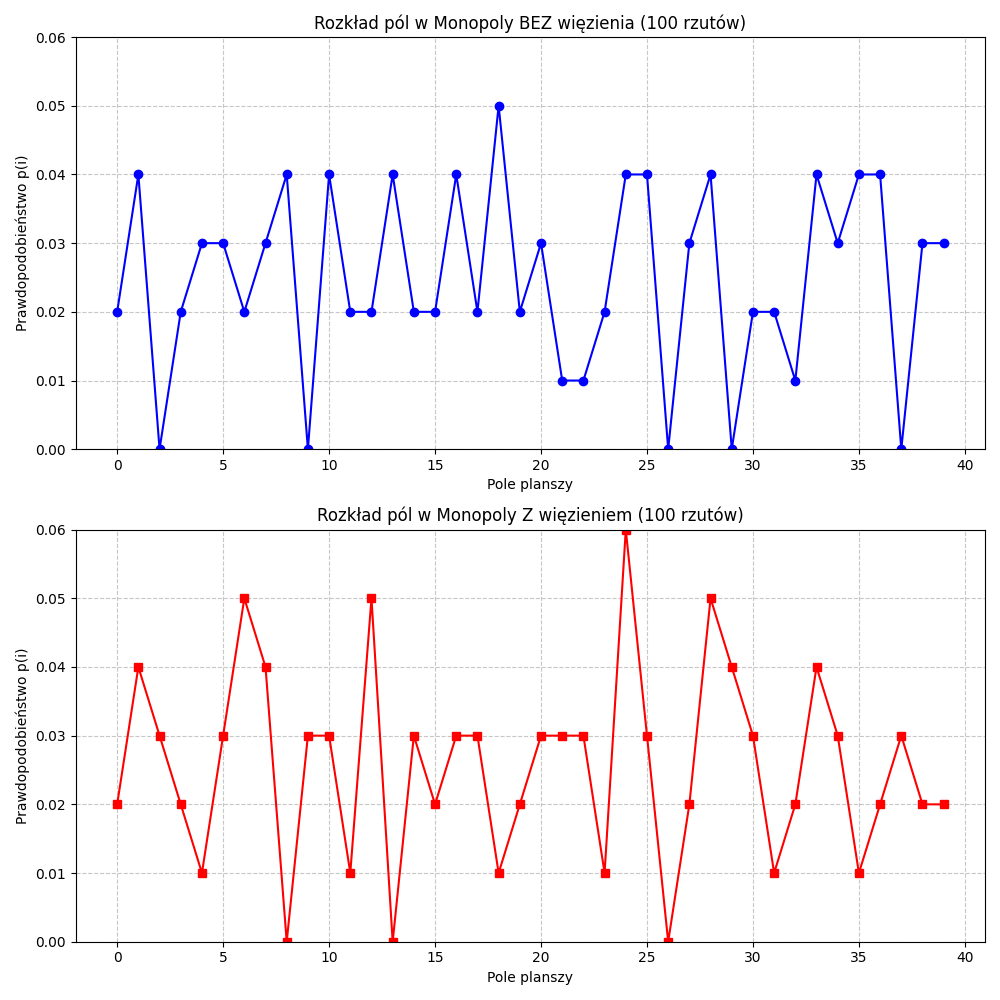
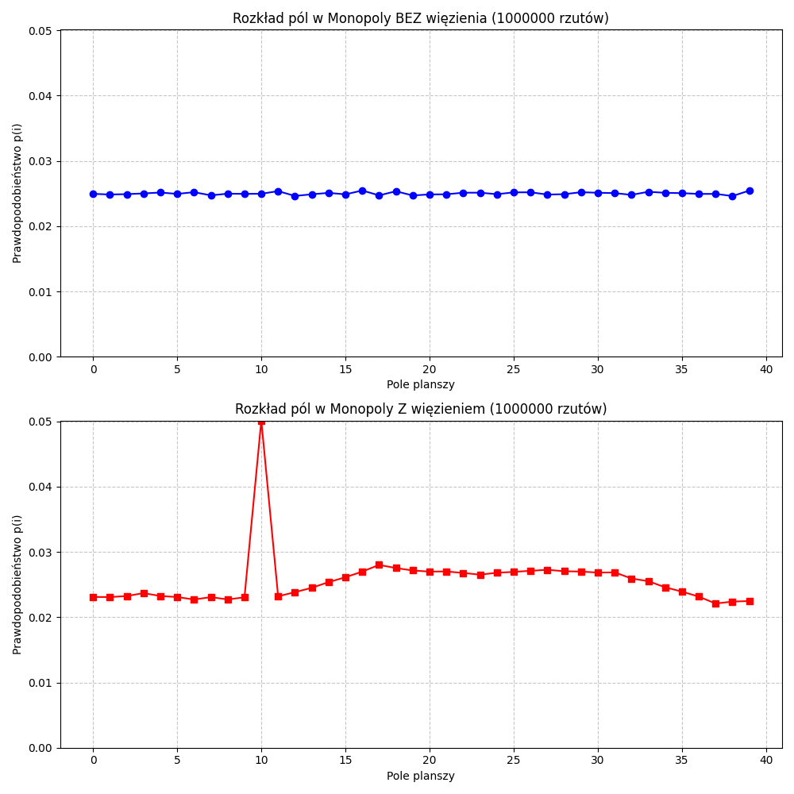

**Task 1** 
  # 🎲 Monopoly Board Simulation

  This project simulates a player moving on a **40-field Monopoly board** based on two dice rolls. The simulation runs for **100     and 1,000,000 rolls**, analyzing the probability \( p(i) \) of landing on each field in two cases:  
    1. **Standard movement**  
    2. **With Jail** – Landing on field **30 ("Go to Jail")** moves the player to **field 10 ("Jail")**  

  📂 **[Project Files & Results](monopoly/)**  

  ## 📊 Results  
  The probability distributions are saved as images:  
  - **100 Rolls:**   
  - **1,000,000 Rolls:**   
